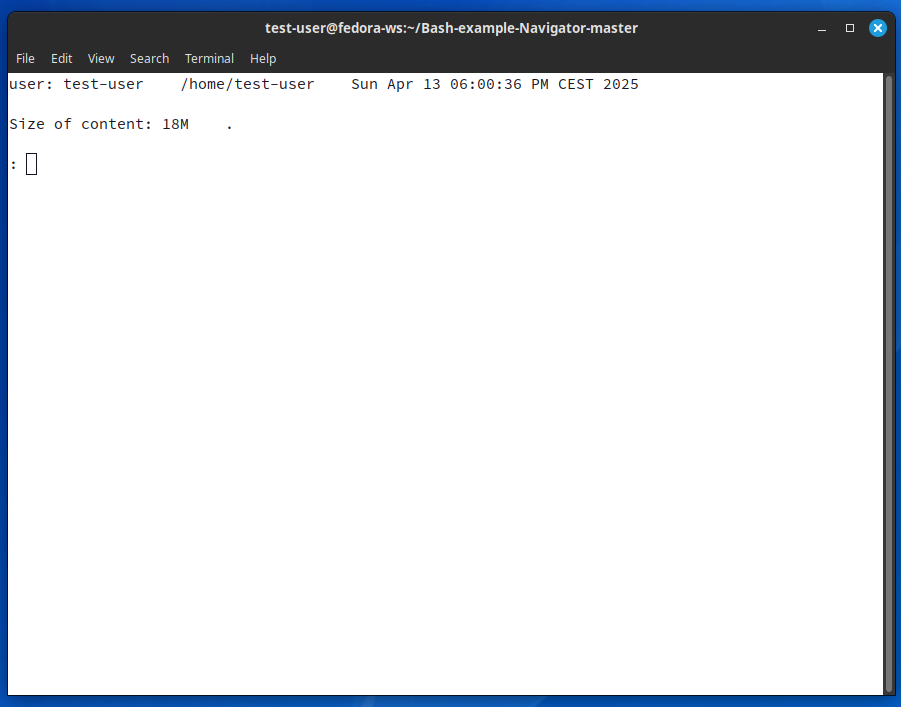

# Bash Navigator

A lightweight terminal-based file navigator and system utility tool written in Bash. Created as a learning project back in 2018.

Here is a screenshot of Navigator in action:



## Features

- **File Operations**: Copy, paste, delete files/directories
- **Directory Navigation**: Move up/down directory tree
- **System Monitoring**:
  - Check CPU usage (`cpustat`)
  - View disk temperatures (`hddtmp`)
  - DNS status monitoring (`dnsup`)
- **Utilities**:
  - Permission management (`chmod`)
  - Directory content/size analysis (`content`, `usage`)
  - User session info (`whois`)

## Installation

1. Clone the repository:
   ```bash
   git clone https://github.com/yourusername/bash-navigator.git
   cd bash-navigator
   ```

1. Make scripts executable:
    
```bash
    chmod +x navigator.sh functions.sh
```
2. _(Optional)_ Add to your `.bashrc` for global access:
```bash
function navigator()
{
	default_position=$(pwd)
	path_to_script=<PATH_TO_SCRIPT> #f.e. /home/currrent_user/
	cd "$path_to_script"
	$path_to_script/navigator.sh "$default_position"
	echo "Navigator ended."
	cd "$default_position"
	default_position=""
}
```

## Usage

Run the navigator:
```bash
./navigator.sh [starting_directory]
```

or:
```bash
navigator #if you added function to .bashrc in previous step
```
### Key Commands

| Command  | Description            |
| -------- | ---------------------- |
| `..`     | Move up one directory  |
| `cd`     | Change directory       |
| `copy`   | Select file to copy    |
| `help`   | Show Helpfile          |
| `paste`  | Paste copied file      |
| `rm`     | Delete file            |
| `hddtmp` | Show disk temperatures |
| `q`      | Quit                   |

Press `Ctrl+C` to interrupt any operation.

## Requirements

- Bash 4.0+
    
- Core utilities:
    
    - `du`, `ls`, `mkdir`, `rm`
        
    - `hddtemp` (for disk temps)
        
    - `dig` (for DNS checks)
        
    - `mpstat` (for CPU stats)
        

---

> **Note**: This tool is designed for Unix-like systems (Linux/macOS).  
> Some features may require root permissions (e.g., `hddtemp`).
